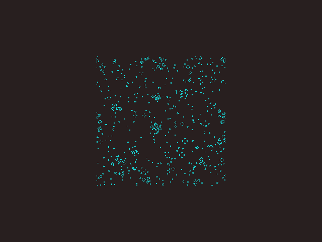

# Conway's Game of Life in a Bootloader

This is an implementation of [Conway's Game of Life](https://en.wikipedia.org/wiki/Conway%27s_Game_of_Life) that fits within a 512-byte floppy bootloader for the IBM PC.

As an additional challenge, the implementation is limited to only the instructions and addressing modes available on the original [Intel 8086](https://en.wikipedia.org/wiki/X86_instruction_listings).



## Implementation

### Limitations of the Original Intel 8086

Being limited to the instructions and addressing modes of the original 8086 presents some interesting challenges:

* Indirect memory accesses can only be performed using `bx`, `bp`, `si`, and `di`.
* `shl` and `shr` cannot be used with an immediate operand greater than `1` (must use `cl` instead).
* Register operands for numerous instructions, like `mul`, cannot be changed.
* No `movzx`.
* No `fs` or `gs` segments.
* 16-bit registers only.

The main consequence of this is the need for a lot of register juggling.

### Memory Usage

The world is made up of 256x256 cells (65,536 in total) that are each either alive or dead. To cut down on complexity and instructions (e.g. for bitwise operations), each cell is stored using one byte. Thus it takes 65,536 bytes to store the state of the world at one simulation step, which happens to be the size of a 16-bit x86 segment.

During each simulation step, `ds` points to the current world state and `es` points to the next world state. The stack segment, `ss`, is repurposed as a third data-segment for accessing VGA RAM. As a result, the main loop cannot make use of the stack, though it nevertheless runs and renders the simulation in a single pass.

Although an inefficient use of memory, the storage of each cell's state as a single byte means that a 16-bit general-purpose register can hold the byte offset of a cell while its partial 8-bit registers automatically take the values of that cell's X and Y co-ordinates. The partial registers can be operated on separately without a carry from the lower into the upper, thus creating the correct wraparound behaviour at the world's edges.

### Random Number Generator

The initial state of the world is populated using a xorshift pseudorandom number generator ([based on an implementation by John Metcalf](http://www.retroprogramming.com/2017/07/xorshift-pseudorandom-numbers-in-z80.html)).

The seed value for PRNG is derived from the current time, which is read from the CMOS.

### Graphics

BIOS video mode `11h` (1-bit 640x480) is used for graphics. This resolution allows the 256x256 world to be seen on screen at once. Unfortunately this requires additional instructions for reading and writing the individual bits for each cell.

The colour-palette is customised via the VGA DAC.

### Timing

The interval timer (IRQ0) is used to control the speed of execution.

## Building

Install `nasm` (tested with version `2.15.05`), then build using:

```sh
make all
```

## Running

Install `qemu-system-i386` (tested with version `7.2.90`), then run using:

```sh
make run
```
